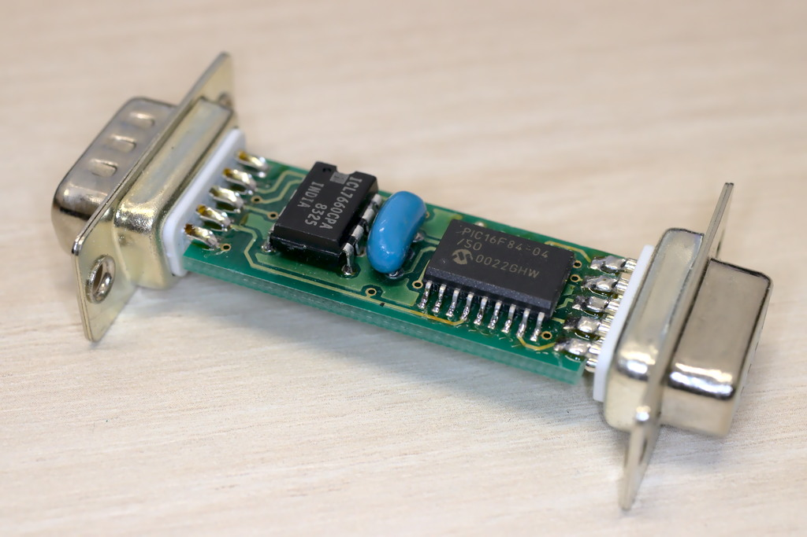

# YAMI - Yet Another Mouse Interface

YAMI is a mouse interface that enables serial PC mice to be used on AMIGA or ATARI ST computers.

YAMI is released under [GPL v3](http://www.gnu.org/licenses/gpl.html).

## Features

* Allows to connect a serial PC mouse to the Amiga mouse connector.
* Supports Logitech and Microsoft protocol.
* Supports up to three mouse buttons.
* Hardware support for the mouse wheel (both X and Y axis). Requires software with mouse wheel support.
* Joystick mode: Joysticks can be parallel connected (using a Y cable).
* No drivers required for standard mouse operation. Mouse is available even in games, demos and the boot menu.
* Matured firmware that proved its reliability over years.
* Made of cheap components that are easy to get at electronic stores.
* Schematics and Source Code available at [GitHub](https://github.com/shred/yami).

## Important!

YAMI is only designed for **serial** PC mouses. This kind of mouse is extremely hard to find nowadays. Some PS/2 mice can be used on a serial line with a PS/2-to-serial adapter. If you are using a PS/2 mouse, make sure that your mouse does actually support such an adapter! A good hint is that the mouse came with such an adapter enclosed.

Today's computer mouses only support USB (and a few *maybe* PS/2 with an adapter). Sadly, you cannot use these with YAMI. Don't even think about connecting a USB mouse to a PS/2 adapter, and the PS/2 adapter to a serial adapter. You will most likely destroy your hardware that way.

**NEVER NEVER EVER** connect an Amiga or Atari mouse to YAMI. You will kill that mouse if you do so. Also do not connect Amiga or Atari joysticks to YAMI, and do not connect other serial devices to YAMI. Just because it plugs, doesn't mean that it also plays.

In other words, if you want to be on the safe side, **only connect a serial mouse to YAMI**.

Actually, I had planned a YAMI2 that was designed to support USB mice. Anyhow handling USB data traffic requires more sophisticated hardware and software. The dying Amiga platform wasn't much of a motivation for me to start the project.

## Assembling the Hardware

YAMI is easily assembled if you know how to read schematics and use a soldering iron. You will find the schematic diagram and a bill of material in the "schematics" directory.

If you use an Atari ST, or if you won't use the mouse wheel on your Amiga, you can spare the connector named "JOY", which saves you some tedious wiring.

The YAMI hardware does some voltage tricks. Please make sure that you build the YAMI hardware *exactly* after the schematics. If you fail to do so, and if you're lucky you will only damage your mouse and your YAMI hardware. With bad luck you will also destroy your Amiga or Atari vintage computer though, so be extra careful.

Check everything at least twice and then once more, before you connect YAMI for the first time.

## Flashing YAMI to the PIC processor

The most difficult task is to flash the PIC processor. Maybe you know someone who has a programmer, but there are also construction manuals for cheap DIY programmers in the interwebs.

In the "dumps" directory, you will find hex dumps that are ready for being flashed into the PIC processor.

* `yami-p.hex` - contains the YAMI firmware (this one is mandatory)

You also need *one* of these EEPROM dumps, depending on your requirements:

* `yami-d-wheel.hex` - AMIGA version, with mouse wheel support (use this one if you are in doubt)
* `yami-d.hex` - AMIGA version, without mouse wheel support (whatever it would be good for)
* `yami-d-atari.hex` - ATARI ST version, without mouse wheel support (Atari owners would positively want this one)

Note that there is no EEPROM dump for Atari ST with wheel support. Of course, this is due to hardware limitations of the Atari ST. ;-)

If you want to flash your PIC from the source code, make sure to properly configure the EEPROM with the appropriate AMIGA/ATARI and WHEEL/NO WHEEL flags.

By the way: YAMI is designed to be in-circuit programmable and updateable. I had built a special programmer that was connected to the Amiga's floppy port, and to both ports of YAMI. Maybe you'll find out how I did the trick.

## Using YAMI

Using YAMI is fairly easy.

Connect your serial PC mouse (or a PS/2 mouse with the included serial adapter) to the SERIAL port of YAMI.

Turn off your Amiga/Atari (yes, in the good old days, computers had to be turned off for that), then connect YAMI's MOUSE connector to the mouse port of your computer. Optionally, also plug the JOY connector to the
joystick port of your Amiga.

Now turn on your computer. The PC mouse should work right from the start. No drivers are required. At least unless you want to use the mouse wheel.

For the mouse wheel, you need to install the "YamiCX" commodity. You can find the source code in the "yamiCX" directory, and a compiled binary on [AmiNet](http://aminet.net/package/util/mouse/yamiCX).

Please do not expect the mouse wheel comfort of modern computers. AmigaOS was never designed for it, so only a few applications actually make use of it.

## Joystick Mode

YAMI offers a special joystick mode. To use it, you will need a DB9 Y cable for each joystick. Connect the Y cable to the joystick port of your computer. On the one end of the Y cable, you connect the joystick, and on the other end you connect the appropriate YAMI port. You can also connect a second Y cable to the mouse port of your computer, in order to connect a second joystick.

Now, if you want to use the joystick, just press on its fire button. YAMI will detect that, and will turn off the mouse signals. You can start using the joystick now, without YAMI interfering.

If you want to use the mouse again, just move it. YAMI will immediately resume its work.

Please only use simple switched joysticks (like the good old _Competition Pro_). Do not use analog joysticks or other funny sticks. They might interfere with YAMI if you use the mouse, and they might even damage YAMI!

## FAQ

* _Can I purchase an assembled and ready-to-use YAMI from you?_

  Unfortunately not. I have already sold the last stock of YAMI many years ago. I also don't have any PCBs left.

* _I have no way to flash a PIC processor. Can I purchase a preprogrammed PIC processor from you?_

  Sadly no, as I also don't have a PIC programmer any more.

* _What happens if I use the Atari ST version on an Amiga (or vice versa)?_

  The mouse will behave erratic when moved, but it won't damage your hardware.

* _Is there also a keyboard interface?_

  Actually, yes. I was working on _YAKI_, and it had some cool features (like reprogrammable keys). However there also have been some very annoying bugs. I was never really able to fix them because I had reached the memory limit of the PIC processor.

## Disclaimer

I was myself using my YAMI interface for a decade, and I am still using it today when I get in a nostalgic mood. It proved to be very reliable, and a good companion to my Amiga. There were also a number of YAMI interfaces sold in the past, and I had never received a complaint. So I am very confident that the design of YAMI is safe.

Anyhow please be aware that this hardware has the potential to damage your good old vintage computer, especially if you use a fancy mouse, or if you make a mistake assembling the hardware or flashing the firmware.

You got the YAMI schematics, source codes and binaries free of charge. It's a gift, and it's even licensed under GNU Public License v3. It's meant as a favor to all the Amiga and Atari lovers out there.

You use all this information as is, on your own risk and without any guarantees expressed or implied.

If you do not exactly know how to read the schematics, purchase the required components, build the hardware and flash the firmware, please ask someone who does know.
